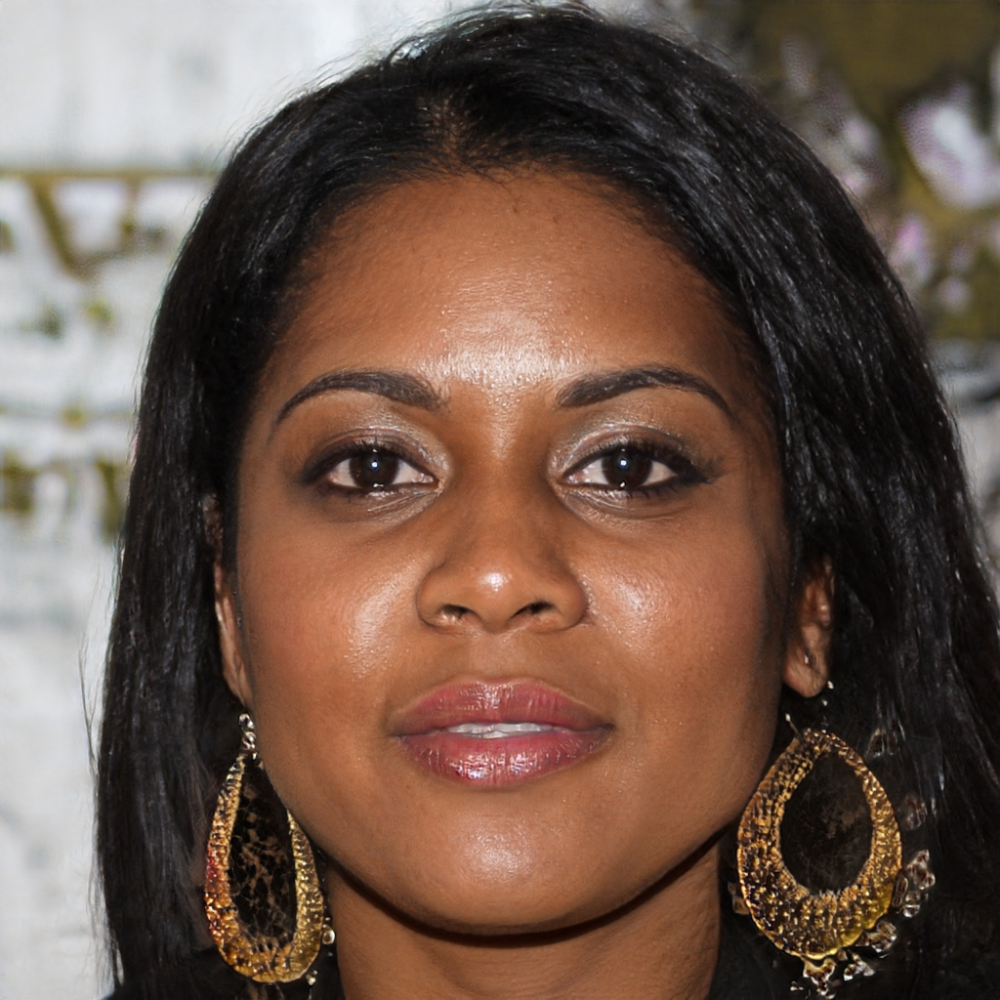
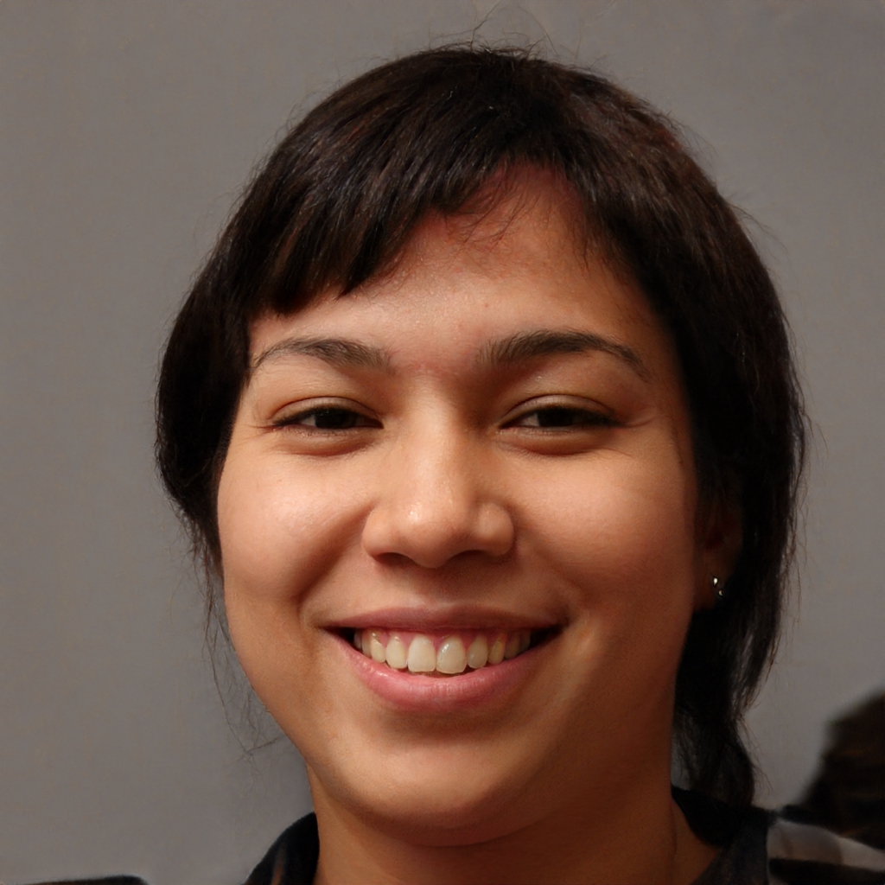
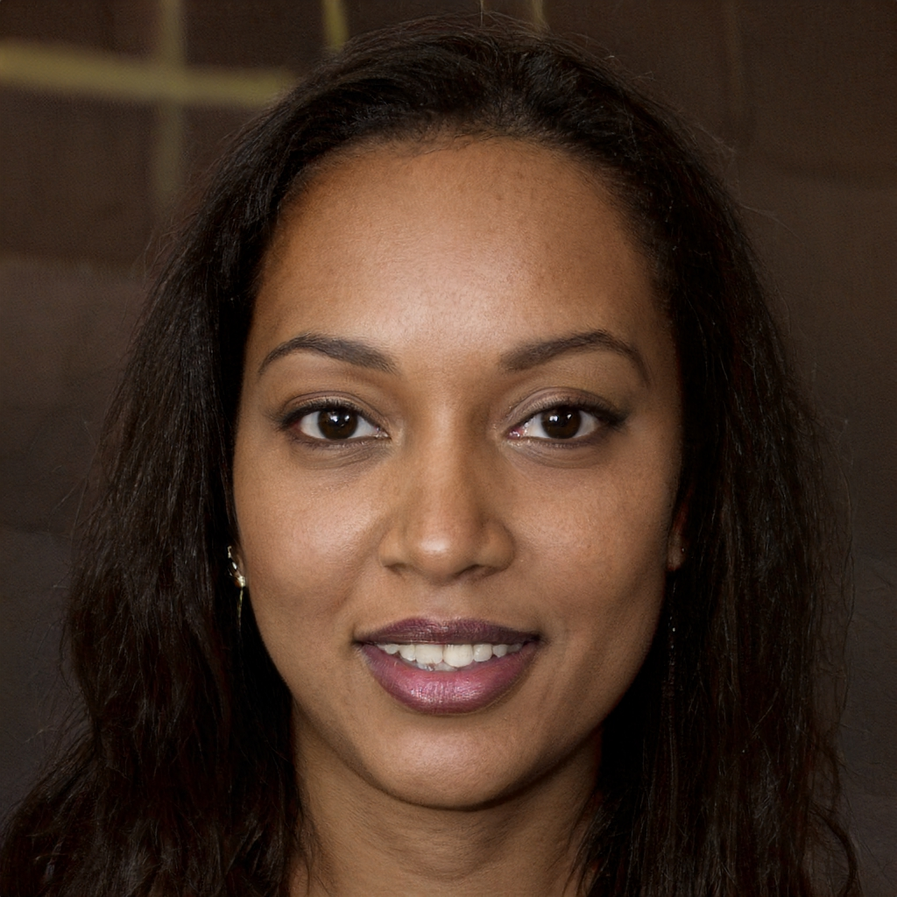

# Personas

## Introdução

&emsp;&emsp;A criação de personas é um método utilizado para representar um grupo de usuários finais durante discussões de design, ou seja, consiste na criação de perfis fictícios que serão definidos com rigor e detalhe para representar os usuários “típicos” do sistema que será analisado<a href="#1">1</a>.

## Metodologia 

&emsp;&emsp;Para criar as personas desse projeto foi utilizado principalmente os dados obtidos no perfil de usuário, ou seja, através das respostas dos questionários foram elaborados os perfis que se supõe que sejam os usuários “típicos” do site da CAESB. Além do uso desses dados obtidos no questionário, também foram criadas personas baseadas em outras técnicas como a análise de dados, no qual foram criadas personas com idades, profissões e características mais diversas que se supõe que também correspondem aos usuários do site avaliado. Além disso para esse projeto serão utilizadas quatro personas, essa escolha foi orientada pelo intervalo recomendado por Courage e Baxter(2005) de 3 a 12 personas<a href="#2">2</a> e serão definidas duas personas primárias, uma persona secundária e por fim, uma antipersona. As personas primárias e a secundárias sendo as que têm contato com o sistema e abrangem os dados coletados e estimados para representar o papel de usuários do site, enquanto a antipersona representa um usuário que não se encaixa nos dados levantados e nao seria usuário do site da CAESB. 

&emsp;&emsp;As tabelas de 1 a 4 apresentam o elenco de personas.

<b>Tabela 1</b> - Persona Primária Daniel Paulo Nunes.

|
<figure markdown>                           |
| -------------------------------------------------------------------------------------------------------------------------------------------------------------------------------------------------------------------------------------------------------------------------------------------------------------------------------------------------------------------------------------------------------------------- |
| **Status**: Persona Primária.|
| **Nome**: Daniel Paulo Nunes|   
| **Descrição**: 40 anos, reside em Brasília, Professor de matemática do ensino médio, sempre busca inovar e conscientizar seus alunos e sua comunidade.Homem.Casado.|                 
| **Relacionamento**: Possui muitos amigos em sua vizinhança e gosta muito de interagir com sua comunidade de alunos e amigos, além de sua esposa e filhos que são as pessoas que mais confia e estão sempre ao seu lado.|
| **Habilidades**: Daniel tem muito conhecimento na área da matemática e um pouco de experiência com o uso de computadores, quando precisa de ajuda com tecnologia pede auxílio para seus filhos.|
| **Tarefas**: Das 08 até 12 Daniel dá aulas de matemática na sua escola e após esse horário volta para almoçar em sua casa com sua família. No resto do dia estuda e prepara suas aulas para o dia seguinte. |
| **Objetivo**: Sempre melhorar como profissional e buscar informações e serviços para sempre contribuir com sua comunidade.|
| **Expectativa**: Consultar as contas com agilidade, ter opções de pagamento e simular valores de conta com clareza com relação ao consumo. |
| **Requisitos**: Retirar segunda via de contas, consultar débitos e simular conta |

<b>Tabela 2</b> - Persona Primária Carla Mendes.

|
<figure markdown>                           |
| -------------------------------------------------------------------------------------------------------------------------------------------------------------------------------------------------------------------------------------------------------------------------------------------------------------------------------------------------------------------------------------------------------------------- |
| **Status**: Persona Primária.|
| **Nome**: Carla Mendes|   
| **Descrição**: 32 anos, reside no Gama, dona de uma loja de perfumes, busca sempre melhorar sua loja para seus clientes. Mulher. Solteira.|                 
| **Relacionamento**: Convive muito com sua família e amigos, possui um vínculo muito forte com outros lojistas de sua região.|
| **Habilidades**: Possui habilidade no gerenciamento de estoque e muita habilidade social..|
| **Tarefas**: Acorda cedo e no período da manhã faz o gerenciamento de produtos da sua loja enquanto realiza atendimentos até o final da tarde. No período da noite se reúne com outros lojistas e debate problemas e oportunidades.|
| **Objetivo**: Sempre melhorar seu atendimento e sua loja, atraindo mais clientes e fortalecer as amizades com outros colegas lojistas.|
| **Expectativa**: Realizar rapidamente essas consultas e conseguir reportar algum problema de sua comunidade de lojistas com agilidade e sem complicações.|
| **Requisitos**: Consultar e reportar problemas com fornecimento de água, furto de hidrômetro, vazamentos entre outros. |

<b>Tabela 3</b> - Antipersona Julia Oliveira.

|
<figure markdown>                           |
| -------------------------------------------------------------------------------------------------------------------------------------------------------------------------------------------------------------------------------------------------------------------------------------------------------------------------------------------------------------------------------------------------------------------- |
| **Status**: Antipersona.|
| **Nome**: Julia Oliveira|   
| **Descrição**: 19 anos, reside em Brasília, cursa medicina veterinária na universidade de brasília.Mulher.Solteira.|                 
| **Relacionamento**: Muito próxima de seus amigos da universidade e família, gosta muito de sair e conhecer novas pessoas.|
| **Habilidades**: Muita habilidade social para interagir com pessoas novas e bastante conhecimento de tecnologias.|
| **Tarefas**: Acorda cedo e das 7 às 14 fica na faculdade, após isso retorna para casa e conclui seus estudos e tarefas. No final de semana gosta de sair com seus colegas pela noite|
| **Objetivo**: Se formar uma boa profissional veterinária e manter um vínculo com seus amigos da faculdade.|
| **Expectativa**: Não identificados. |
| **Requisitos**: Não identificados pela falta de interesse com relação ao fornecimento de água de sua região. Seus pais ficam responsáveis por essas questões.|

<b>Tabela 4</b> - Persona secundária Pamela Azevedo.

|
<figure markdown>                           |
| -------------------------------------------------------------------------------------------------------------------------------------------------------------------------------------------------------------------------------------------------------------------------------------------------------------------------------------------------------------------------------------------------------------------- |
| **Status**: Persona secundária.|
| **Nome**: Pamela Azevedo|   
| **Descrição**: 27 anos, reside em Brasília, trabalha como gerente de marketing em uma grande empresa.Mulher.Solteira.|                 
| **Relacionamento**: Possui muitos amigos em sua empresa e se relaciona principalmente com eles e sua família.|
| **Habilidades**: Possui muita habilidade de gerência e de socialização. Possui um conhecimento médio acerca de tecnologias e quando precisa de auxílio pede ajuda ao setor de tecnologia da empresa.|
| **Tarefas**: Pamela entra no trabalho a partir das 8 e fica até às 16, depois gosta de sair com seus colegas. Normalmente até às 20 já está em casa e gosta de tomar um bom banho e relaxar para o próximo dia.|
| **Objetivo**: Pamela deseja evoluir profissionalmente e conseguir sempre ajudar seus colegas da empresa.|
| **Expectativa**: Fazer essa consulta rapidamente e obter uma previsão do retorno do serviço com clareza. |
| **Requisitos**: Verificar o status da ocorrência da falta de água em sua casa bem ocasionalmente.|

## Referências

> 
 1. BARBOSA, S. D. J.; SILVA, B. S. Interação Humano-Computador. Rio de Janeiro: Elsevier, 2011.

>
 2.  Courage, C. & Baxter, K. Understanding your users: a practical guide to user requirements, methods, tools, and techniques. San Francisco, CA: Morgan KaufmannPublishers, 2005.

## Histórico de versão

| Versão |    Data    |      Descrição       |  Autor(es) | Revisor(es) |
| :----: | :--------: | :------------------: | :-----: | :-----: |
|  1.0   | 15/10/2023 | Adiciona Personas | Oscar e Pedro | Leandro |

