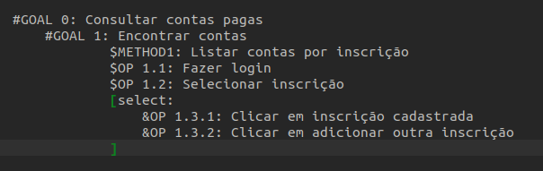
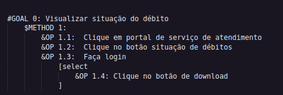

# GOMS (Goals, Operators, Methods and Selection Rules)

## Introdução

&emsp;&emsp;O GOMS<a href="#4">3</a>, abreviação para Goals, Operators, Methods, e Selection rules, é um método que descreve uma tarefa e o conhecimento do usuário sobre como realizá-la. Ele se desdobra em quatro componentes essenciais:

1. **Objetivos (Goals):** 
&emsp;&emsp;Estes representam o que o usuário deseja alcançar ao usar o software, como por exemplo, editar um documento.

2. **Operadores (Operators):** 
&emsp;&emsp;Operadores podem ser primitivas internas (cognitivas) ou externas (ações físicas que o software permite aos usuários executar). Exemplos incluem comandos digitados no teclado, seleção de itens de menu ou clicar em botões.

3. **Métodos (Methods):** 
&emsp;&emsp;Os métodos são sequências bem estabelecidas de subobjetivos e operadores que permitem que o usuário alcance um objetivo maior. 

4. **Regras de Seleção (Selection rules):** 
&emsp;&emsp;Quando existem várias maneiras de alcançar o mesmo objetivo, são necessárias regras de seleção. Estas representam as decisões tomadas pelo usuário sobre qual método usar em uma determinada situação.

&emsp;&emsp;Em resumo, o GOMS fornece uma estrutura para representar o conhecimento procedimental de uma pessoa ao realizar tarefas em um dispositivo específico. 

## CMN-GOMS

&emsp;&emsp; Será utilizado a abordagem CMN-GOMS como modelo da análise de tarefas, pois com essa técnica há uma hierarquia estrita de objetivos e com ela os operadores são
executados estritamente em ordem sequencial, tendo os métodos como representações em uma
notação semelhante a um pseudocódigo, que inclui submétodos e condicionais. 

## Consultar Contas Pagas

&emsp;&emsp;Nessa tarefa, o usuário precisa acessar a página de consultar contas pagas, realizar login e acessar informações a respeito das faturas pagas listadas com base no mês. Logo abaixo, segue a figura da análise utilizando o método GOMS.

<b>Figura 1</b> - Método GOMS de consulta a Contas Pagas.
 

{width=500px}

Fonte: <a href="https://github.com/JeffersonSenaa" target="_blank">Jefferson Sena</a>

## Consultar Falta de Água

&emsp;&emsp;Nessa tarefa, o usuário precisa acessar a página de consulta a falta de água e acessar informações a respeito da falta de água em um área de uma região administrativa do DF.

<b>Figura 2</b> - Método GOMS de consulta a Contas Pagas.

{width=800px}

Fonte: <a href="https://github.com/Tiago1604" target="_blank">Tiago Albuquerque</a>

## Emitir segunda via da conta

&emsp;&emsp;Nessa tarefa, o usuário precisa acessar a página de segunda via da conta, realizar login e acessar as informações a respeito da conta.

<b>Figura 3</b> - Método GOMS de consulta a Contas Pagas.

{width=500px}

Fonte: <a href="https://github.com/leomitx10" target="_blank">Leandro de Almeida</a>

## Informar vazamento na rua

&emsp;&emsp;Para essa tarefa o objetivo do usuário seria informar à CAESB um vazamento de água ou esgoto no endereço em questão.

<b>Figura 4</b> - Método GOMS de informar vazamento na rua.

{width=500px}

Fonte: <a href="https://github.com/Muniz2811" target="_blank">Pedro Henrique</a>

## Revisão de Conta 

&emsp;&emsp; Nessa tarefa, o usuario ira fazer a revisão das suas contas, onde ele precisa acessar o site da caesb, acessar a pagina revisão de conta, fazer o login, selecionar a residência onde queira fazer a revisão, selecionar a conta a ser revisada e por fim clicar no botão "Selecionar revisão".

<b>Figura 5</b> - Método GOMS de Revisão de Conta.

{width=500px}

Fonte: <a href="https://github.com/rodfon3301" target="_blank">Rodrigo Fonseca</a>

## Consultar Qualidade da Água  

&emsp;&emsp; Nessa tarefa, o usuario ira consultar a qualidade da água em sua região administrativa. No qual ele precisa acessar o site da caesb, acessar o menu "Água", acessar o submenu "Controle de Qualidade", selecionar "Análises e Resultados", por fim clicar em  "Resultados na Rede de Distribuição - Síntese por Sistemas de Abastecimento" ou  "Qualidade da Água Distribuída" ou "Relatório Anual da Qualidade da Água". Caso selecionado "Relatório Anual da Qualidade da Água", clicar no ano desejado. 

<b>Figura 6</b> - Método GOMS de consulta a qualidade da Água.

{width=800px}

Fonte: <a href="https://github.com/mateus9levy" target="_blank">Mateus Levy</a>

## Situação de débitos

&emsp;&emsp;Nessa tarefa o usuário precisa acessar a área de autoatendimento, clicar em situação de débito, efetuar o login e  verificar a situação de suas respectivas contas.

<b>Figura 7</b> - Método GOMS de Situação de débitos.

{width=500px}

Fonte: <a href="https://github.com/OscarDeBrito" target="_blank">Oscar de Brito</a>

## Referências 

> 
 1. BARBOSA, S. D. J.; SILVA, B. S. Interação Humano-Computador. Rio de Janeiro: Elsevier, 2010.

> 
2. Bilheteria Digital. Disponível em> <a href="https://interacao-huma no-computador.github.io/2023.1-BilheteriaDigital/analise-de-requisitos/analise-de-tarefas/hta/">https://interacao-humano-computador.github.io/2023.1-BilheteriaDigital/analise-de-requisitos/analise-de-tarefas/hta/</a>. Acesso em 14 de outubro de 2023.

## Bibliografia

> 
1. Bilheteria Digital. Análise Hierárquica de Tarefas. Repositório do Grupo Bilheteria Digital da disciplina de Interação Humano Computador da Universidade de Brasília, 2023. Disponível em: https://interacao-humano-computador.github.io/2023.1-BilheteriaDigital/analise-de-requisitos/analise-de-tarefas/hta/. Acesso em: 16 de out. 2023.

## Histórico de versão
| Versão |    Data    |      Descrição       |  Autor(es) | Revisor(es) |
| :----: | :--------: | :------------------: | :-----: | :-----: |
|  1.0   | 17/10/2023 | Adicionando página do GOMS | Tiago e Jefferson | Rodrigo e Mateus |