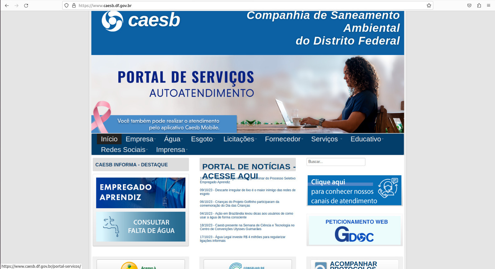

## Introdução
 
&emsp;&emsp;A usabilidade de um site desempenha um papel fundamental na experiência do usuário, influenciando diretamente sua satisfação e eficiência na realização de tarefas. No caso do site da CAESB (Companhia de Saneamento Ambiental do Distrito Federal), é crucial garantir que os visitantes tenham uma experiência eficaz e agradável ao interagir com o site. Para isso, são definidas metas de usabilidade que orientam o desenvolvimento e aprimoramento do site, visando atender às necessidades e expectativas dos usuários. As metas de usabilidade que serão tratadas nesse documento são as metas de usabilidade definidas pelo pesquisador Nielsen.

## Objetivo

&emsp;&emsp;O propósito deste documento é identificar e descrever as características da plataforma com base nas metas de usabilidade. Essas metas de usabilidade têm o intuito de oferecer ao designer de interação um método de avaliação dos aspectos da experiência do usuário em relação a um produto interativo.

## Metodologia

&emsp;&emsp;Para identificar as  características da plataforma e analisar as metas de usabilidade do site da CAESB, será percorrido o site a partir da perspectiva das características levantadas no perfil de usuário, dessa forma se analisando os aspectos de eficácia, eficiência, segurança, utilidade, aprendizado e memorização.

## Definição da Metas de Usabilidade:
### *1. Eficácia:*

&emsp;&emsp;Uma regra geral que visa avaliar o desempenho de um sistema em relação à sua capacidade de atender às expectativas dos usuários, permitindo que eles aprendam facilmente a usá-lo, realizem suas tarefas de forma eficaz, acessem as informações que precisam e executem outros serviços de maneira satisfatória. O sistema deve fazer o que se espera dele.

### *2. Eficiência:*

&emsp;&emsp;A eficiência diz respeito à rapidez com que os usuários podem concluir suas tarefas. Um sistema eficiente permite que as tarefas sejam realizadas de forma rápida, economizando tempo e esforço.

### *3. Segurança:*

&emsp;&emsp;A segurança visa proteger os usuários de ações indesejadas ou erros graves. Isso inclui a prevenção de situações perigosas e a capacidade de recuperação em caso de erros, garantindo que o usuário não cause danos significativos acidentalmente.

### *4. Utilidade:* 

&emsp;&emsp;A utilidade se concentra na capacidade do sistema de atender às necessidades dos usuários e fornecer valor real. Um sistema útil é aquele oferecem funcionalidades e recursos relevantes e significativos para o usuário.

### *5. Aprendizagem:* 

&emsp;&emsp;Refere-se à facilidade com que os usuários podem aprender a usar o sistema. Um sistema com boa usabilidade deve permitir que os usuários se familiarizem com ele de forma rápida e intuitiva, com um mínimo de esforço.

### *6. Memorização:*

&emsp;&emsp;A memorização envolve a capacidade dos usuários de lembrar como usar o sistema após um período de inatividade. Um sistema de alta usabilidade permite que os usuários recuperem facilmente seu conhecimento sobre como executar tarefas, mesmo após algum tempo sem utilizá-lo.

## Metas almejadas pelo nosso projeto

&emsp;&emsp;O propósito deste documento é identificar e descrever as características da plataforma com base nas metas de usabilidade. Essas metas de usabilidade têm o intuito de oferecer ao designer de interação um método de avaliação dos aspectos da experiência do usuário em relação a um produto interativo.

&emsp;&emsp;Lembrando de que a usabilidade de um site é uma questão subjetiva, e a análise pode variar dependendo do contexto e das necessidades dos usuários. Também podendo considerar a realização de testes de usabilidade com usuários reais para obter feedback mais específico.

### 1. Eficácia:

- **Pergunta:** O site da CAESB permite que os usuários alcancem seus objetivos de forma precisa e completa, como pagar contas ou obter informações sobre serviços?
- **No sistema:** O site demonstra um desempenho notável no quesito eficácia, cumprindo suas tarefas de forma exemplar. O site também oferece informações e noticias.

### 2. Eficiência:

 - **Pergunta:** Os usuários podem realizar tarefas no site da CAESB de forma rápida e eficiente, ou há muitos obstáculos e etapas demoradas no processo?
 - **No sistema:** No quesito eficiência, o site da CAESB tem alguns obstaculos para chegar no resultado final, podendo atrasar o usuario. Como a ausência de algumas opções na tela inicial do site,por exemplo a opção de login. Por isso Então o site da CAESB não cumpre a meta de eficiência.

### 3. Segurança:

- **Pergunta:** O site da CAESB protege os usuários de situações perigosas ou erros graves? Há medidas de segurança para evitar que os usuários cometam erros?

- **No sistema:** Existem mecanismo de proteção no site como indicações visuais em funcionalidades que são protegidas por login, as que dependem de Atualização Cadastral e os serviços que utilizam o novo Peticionamento Web (GDOC). Porém existem vários campos dentro das funcionalidades que permitem os mais diversos erros por parte dos usuários, como entrar com valores negativos em unidades de medidas, não preencher campos obrigatórios, entre outros. Além disso o uso da  alternativa de acessibilidade aumentar a fonte, quebra a formatação do sistema caso seja utilizada algumas vezes, e não há nenhum aviso ou limitação quanto a isso. Por isso o site da CAESB não atende a meta de segurança, necessitando corrigir diversos erros para auxiliar e proteger os usuários do site de forma melhor.

<b>Imagem 1</b> - formatação quebrada pelo aumento da fonte

Fonte: <a href="https://www.caesb.df.gov.br/" target="_blank">Site CAESB</a>

### 4. Utilidade

- **Pergunta:** O site da CAESB oferta funcionalidades que atendem às necessidades dos usuários e forneça um valor real ao sistema ?
- **No sistema:** O sistema fornece várias funcionalidades que são úteis para os usuários do site e facilitam a realização de tarefas, como por exemplo na aba portal de serviços, onde se tem diversas atividades que podem ser realizadas pelo usuário conforme sua necessidade. Além disso, é fornecido um bom suporte na central de ajuda, com perguntas frequentes e um número com atendimento 24 horas. Por tudo isso o site da CAESB cumpre bem a meta de utilidade.

### 5. Aprendizagem
- **Pergunta:** Os usuários conseguem aprender a utilizar o sistema facilmente, de forma rápida e intuitiva? 
- **No sistema:** Aprender a utilizar o site e relativamente simples, porém apresenta algumas dificuldades para pessoas que não estão tão familiarizadas com o uso da internet, alguns pontos como ausência de possibilidade de login na tela inicial, e um excesso de informações também nessa mesma tela podem levar alguns usuários a se sentirem desmotivados e terem dificuldades de aprender a utilizar o sistema. Logo, o site da CAESB atende parcialmente o aspecto da aprendizagem, tendo a possibilidade de melhorias em alguns pontos para facilitar a utilização de todos os usuários.

### 6. Memorização
- **Pergunta:** O sistema permite que os usuários se recordem de como realizar atividades mesmo apos um periodo sem utilizar o site?
- **No sistema:** A utilização do sistema de fácil memorização, ou seja, após aprender a utilizar o sistema e se realizar as tarefas que se deseja, fica fácil mesmo após um período de inatividade recuperar os conhecimentos que se tinha antes sobre o site e lembrar o caminho para realizar as tarefas.

## Referências

> 
1 Preece, J.; Rogers, Y.; Sharp, H. Design de Interação: Além da Interação Humano-Computador. Bookman, 3ª ed. 2013.

## Bibliografia

> 
Diana Fournier. As 6 metas de Usabilidade. MEDIUM, 2016. Disponível em: https://medium.com/vivareal-ux-chapter/as-6-metas-de-usabilidade-9491442fd56a. Acesso em: 19/10/2023.
 

## Histórico de versão

| Versão |    Data    |      Descrição       |  Autor(es) | Revisor(es) |
| :----: | :--------: | :------------------: | :-----: | :-----: |
|  1.0   | 19/10/2023 | Adicionando as Metas de Usabilidade | Pedro e Rodrigo| Oscar |
| 1.1| 20/10/2023 | Finalizando as metas de Usabilidade | Pedro e Rodrigo | Oscar |

