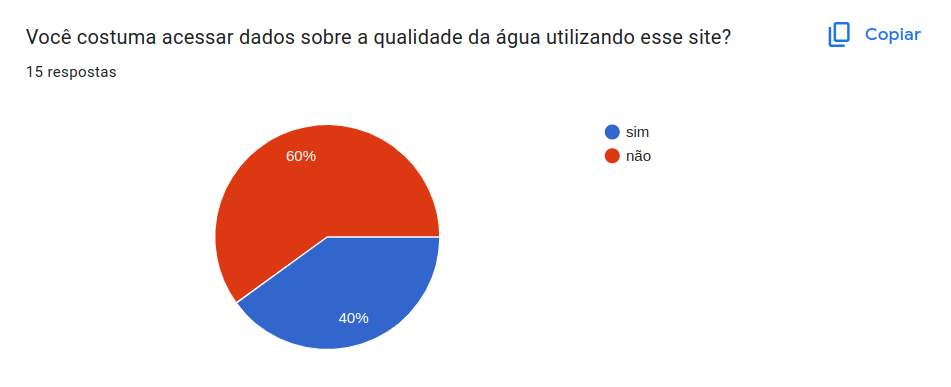
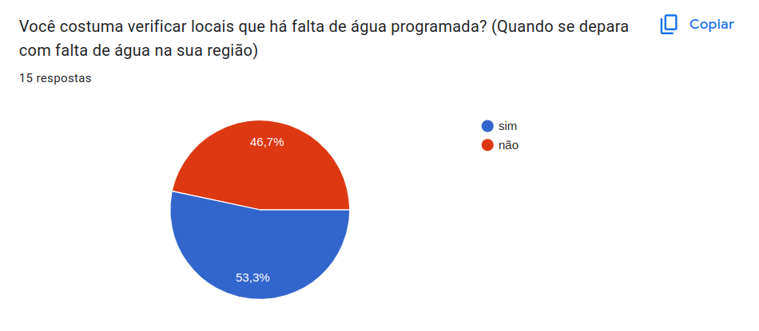

# Perfil do Usuário

## Introdução

&emsp;&emsp;Para entender melhor as necessidades e quem são os usuários do site de análise do projeto será traçado um perfil genérico deles chamado de perfil de usuário. Essa técnica consiste em estabelecer uma descrição das características dos usuários cujos objetivos devem ser apoiados pelo sistema que está se analisando, para isso será identificado as características de interesse e conduzido um estudo para coletar os dados dos usuários<a href="#1">1</a>.

## Metodologia 

&emsp;&emsp;Para estabelecer o perfil de usuário será utilizado o método de questionários, elaborando um formulário on-line que será divulgado em grupos e sites para que os usuários do site da CAESB respondam. A escolha desse método se deu principalmente por permitir que um grande número de pessoas responda e que ele seja respondido do conforto do lar ou local de trabalho. O questionário terá foco em questões fechadas para privilegiar o preenchimento rápido dos participantes e, posteriormente, uma análise mais rápida das respostas.

## Resultados do questionário

&emsp;&emsp;Os resultados do questionário foram bem variados, levando em consideração a diferença tanto de idade quanto de ocupação dos participantes. Também evidenciou-se as diferenças do uso desse site conforme o perfil do usuário.

## Questão 1

## Questão 2

## Questão 3

## Questão 4

## Questão 5

|Em qual região do DF você mora?|Quantidade de pessoas|
|:---------:|:-------:|
|Gama|3|
|Santa Maria|3|
|Guará|1|
|Recanto das Emas|1|
|Samambaia|2|
|Sobradinho|1|
|Taguatinga|1|
|Outro|3|

## Questão 6

|Qual a sua ocupação?|Quantidade de pessoas|
|:---------:|:-------:|
|Aposentado|1|
|Estudante|7|
|Técnico em TI|1|
|Eletricista|1|
|Segurança|1|
|Outro|4|

## Questão 7

|Existe alguma tarefa na qual você acredita que necessita de um apoio maior na execução? Se sim, qual seria essa tarefa?|Quantidade de pessoas|
|:---------:|:-------:|
|Acessar os dados sobre a qualidade da água|3|
|Solicitar serviços relacionados à água e saneamento|2|
|Reclamar sobre o fornecimento de água|2|
|Eletricista|1|
|Segurança|1|
|Outro|4|

## Questão 8

&emsp;&emsp;0 - Pouca experiência

&emsp;&emsp;5 - Muita experiência

## Questão 9

## Questão 10

## Questão 11

## Questão 12

## Questão 13

## Questão 14

## Questão 15

## Questão 16

&emsp;&emsp;0 - Fácil

&emsp;&emsp;5 - Difícil

## Conclusão

&emsp;&emsp;Com base nas respostas coletadas no questionário sobre a Caesb, chegamos a várias conclusões. A maioria dos usuários é do sexo masculino e está na faixa etária de 18 a 24 anos e possui ensino superior incompleto. Além disso, é notável que a maioria deles acessa o site por meio de dispositivos móveis, como celulares.

&emsp;&emsp;Também observamos que muitos usuários não utilizam as diversas funções oferecidas pelo site, tais como fazer reclamações, buscar informações sobre o abastecimento de água, solicitar serviços e consultar a qualidade da água. No entanto, a função de verificar locais onde há falta de água é amplamente utilizada pela maioria dos usuários.

&emsp;&emsp;Quanto à experiência do usuário, percebemos uma divisão de opiniões. Algumas pessoas consideram fácil corrigir um erro cometido por elas mesmas no site, enquanto outras acham essa tarefa um pouco complicada. No entanto, a maioria dos usuários concorda que é fácil encontrar as informações desejadas no site.

## Referências

> 
 1. BARBOSA, S. D. J.; SILVA, B. S. Interação Humano-Computador. Rio de Janeiro: Elsevier, 2011.

## Histórico de versão

| Versão |    Data    |      Descrição       |  Autor(es) | Revisor(es) |
| :----: | :--------: | :------------------: | :-----: | :-----: |
|  1.0   | 13/10/2023 | Adiciona Perfil do Usuário | Pedro e Leandro | Oscar |

