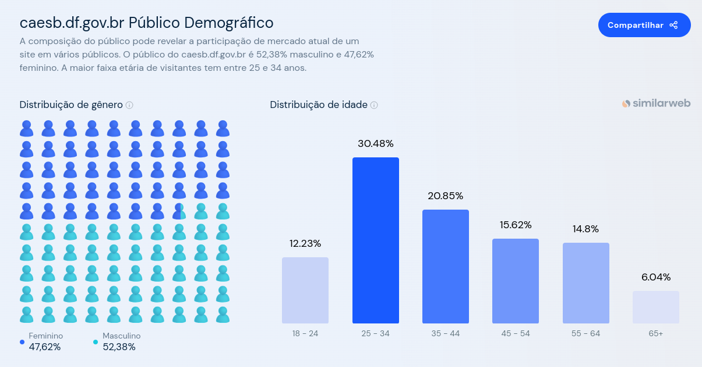

# Perfil do Usuário

## Introdução

&emsp;&emsp;Para entender melhor as necessidades e identificar quem são os usuários do site de análise do projeto, traçou-se um perfil genérico deles, denominado "perfil de usuário". Essa técnica consistiu em estabelecer uma descrição das características dos usuários cujos objetivos deveriam ser apoiados pelo sistema em análise. Para isso, foram identificadas as características de interesse e conduzido um estudo para coletar os dados dos usuários.<a href="#1">1</a>.

## Metodologia 

&emsp;&emsp;Para estabelecer o perfil de usuário, o método de questionários foi utilizado. Foi elaborado um formulário on-line que foi divulgado em grupos e sites para que os usuários do site da CAESB pudessem responder. A escolha desse método se deu principalmente por permitir que um grande número de pessoas respondesse e que ele fosse respondido do conforto do lar ou local de trabalho. O questionário teve foco em questões fechadas para privilegiar o preenchimento rápido dos participantes e, posteriormente, uma análise mais rápida das respostas.

&emsp;&emsp;Também foi utilizada uma plataforma de análise de dados chamada <a href="https://www.similarweb.com/pt/" target="_blanck">SimilarWeb</a>, que fornece informações relevantes sobre o tráfego na web e o desempenho online de sites e aplicativos móveis. Além disso, essa plataforma disponibiliza dados sobre a origem do tráfego, informações demográficas dos usuários e outros dados importantes.

## Resultados da análise de dados (SimilarWeb)

&emsp;&emsp;A maioria dos usuários são do sexo masculino e possuem idades entre 25 e 34 anos. Suas principais áreas de interesse são Informática, Eletrônica e Tecnologia. As figuras abaixo demonstram esses dados.

## Perguntas do questionário

 O número referenciado ao final de cada pergunta levará até a resposta obtida no questionário.

#### Questão 1
Qual a sua idade ? <a href="#2">1</a>

#### Questão 2
Qual o seu sexo ? <a href="#3">2</a>

#### Questão 3
Qual seu nível de escolaridade? <a href="#4">3</a>

#### Questão 4
Qual plataforma você utiliza para acessar o site? <a href="#5">4</a>

#### Questão 5
Em qual região do DF você mora ? <a href="#6">5</a>

#### Questão 6
Qual a sua ocupação? <a href="#7">6</a>

#### Questão 7
Existe alguma tarefa na qual você acredita que necessita de um apoio maior na execução? Se sim, qual seria essa tarefa? <a href="#8">7</a>

#### Questão 8
Qual sua experiência com aparelhos eletrônicos (ex. celulares, computadores e etc) <a href="#9">8</a>

#### Questão 9
Você costuma consultar ou pagar contas em débito em seu nome utilizando esse site? <a href="#10">9</a>

#### Questão 10
Você costuma fazer alguma reclamação acerca do fornecimento da água utilizando esse site?  <a href="#11">10</a>

#### Questão 11
Você costuma buscar informações sobre o abastecimento de água utilizando esse site?  <a href="#12">11</a>

#### Questão 12
Você costuma solicitar serviços relacionados à água e saneamento utilizando esse site?  <a href="#13">12</a>

#### Questão 13
Você costuma acessar dados sobre a qualidade da água utilizando esse site?  <a href="#14">13</a>

#### Questão 14
Você costuma verificar locais que há falta de água programada? (Quando se depara com falta de água na sua região) <a href="#15">14</a>

#### Questão 15
Quão fácil é para você corrigir um erro que você mesmo cometeu ao usar o site da Caesb? <a href="#16">15</a>

#### Questão 16
O quão fácil é para você encontrar as informações no site da CAESB? <a href="#17">16</a>

## Resultados do questionário

&emsp;&emsp;Os resultados do questionário foram bem variados, levando em consideração a diferença tanto de idade quanto de ocupação dos participantes. Também evidenciou-se as diferenças do uso desse site conforme o perfil do usuário.

## Questão 1

 Resultados: 

## Questão 2

 Resultados: 

## Questão 3

 Resultados: 

## Questão 4

 Resultados: 

## Questão 5

 Resultados: 

|Em qual região do DF você mora?|Quantidade de pessoas|
|:---------:|:-------:|
|Gama|3|
|Santa Maria|3|
|Guará|1|
|Recanto das Emas|1|
|Samambaia|2|
|Sobradinho|1|
|Taguatinga|1|
|Outro|3|

## Questão 6

 Resultados: 

|Qual a sua ocupação?|Quantidade de pessoas|
|:---------:|:-------:|
|Aposentado|1|
|Estudante|7|
|Técnico em TI|1|
|Eletricista|1|
|Segurança|1|
|Outro|4|

## Questão 7

 Resultados: 

|Existe alguma tarefa na qual você acredita que necessita de um apoio maior na execução? Se sim, qual seria essa tarefa?|Quantidade de pessoas|
|:---------:|:-------:|
|Acessar os dados sobre a qualidade da água|3|
|Solicitar serviços relacionados à água e saneamento|2|
|Reclamar sobre o fornecimento de água|2|
|Eletricista|1|
|Segurança|1|
|Outro|4|

## Questão 8

 Resultados: 

&emsp;&emsp;0 - Pouca experiência

&emsp;&emsp;5 - Muita experiência

## Questão 9

 Resultados: 

## Questão 10

 Resultados: 

## Questão 11

 Resultados: 

## Questão 12

 Resultados: 

## Questão 13

 Resultados: 

## Questão 14

 Resultados: 

## Questão 15

 Resultados: 

## Questão 16

 Resultados: 

&emsp;&emsp;0 - Fácil

&emsp;&emsp;5 - Difícil

## Conclusão

&emsp;&emsp;Com base nas respostas coletadas no questionário sobre a Caesb, chegamos a várias conclusões. A maioria dos usuários é do sexo masculino e está na faixa etária de 18 a 24 anos e possui ensino superior incompleto. Além disso, é notável que a maioria deles acessa o site por meio de dispositivos móveis, como celulares.

&emsp;&emsp;Também observamos que muitos usuários não utilizam as diversas funções oferecidas pelo site, tais como fazer reclamações, buscar informações sobre o abastecimento de água, solicitar serviços e consultar a qualidade da água. No entanto, a função de verificar locais onde há falta de água é amplamente utilizada pela maioria dos usuários.

&emsp;&emsp;Quanto à experiência do usuário, percebemos uma divisão de opiniões. Algumas pessoas consideram fácil corrigir um erro cometido por elas mesmas no site, enquanto outras acham essa tarefa um pouco complicada. No entanto, a maioria dos usuários concorda que é fácil encontrar as informações desejadas no site.

## Referências

> 
 1. BARBOSA, S. D. J.; SILVA, B. S. Interação Humano-Computador. Rio de Janeiro: Elsevier, 2011.

## Histórico de versão

| Versão |    Data    |      Descrição       |  Autor(es) | Revisor(es) |
| :----: | :--------: | :------------------: | :-----: | :-----: |
|  1.0   | 13/10/2023 | Adiciona Perfil do Usuário | Pedro e Leandro | Oscar |

