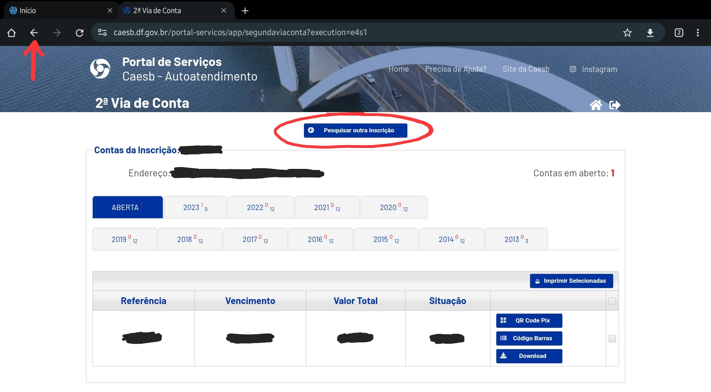
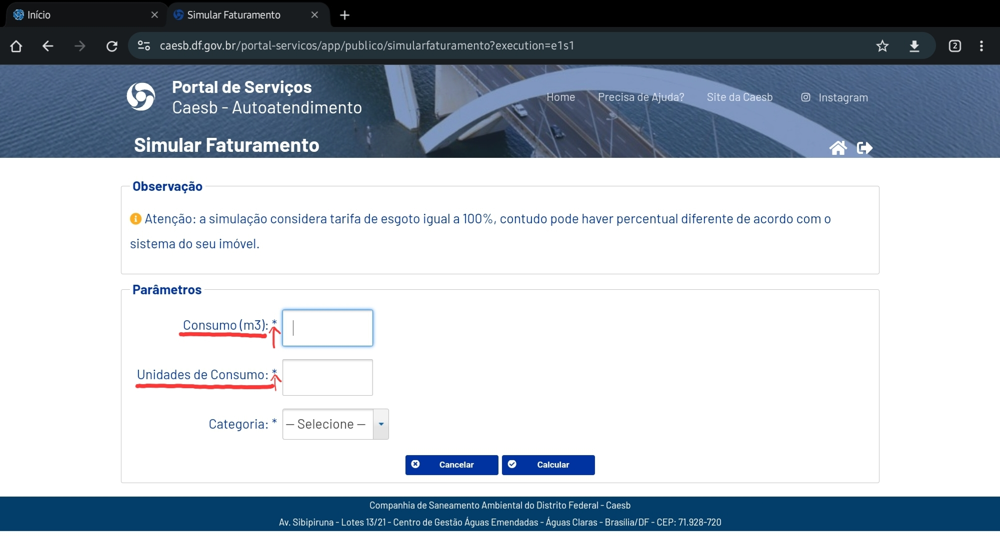
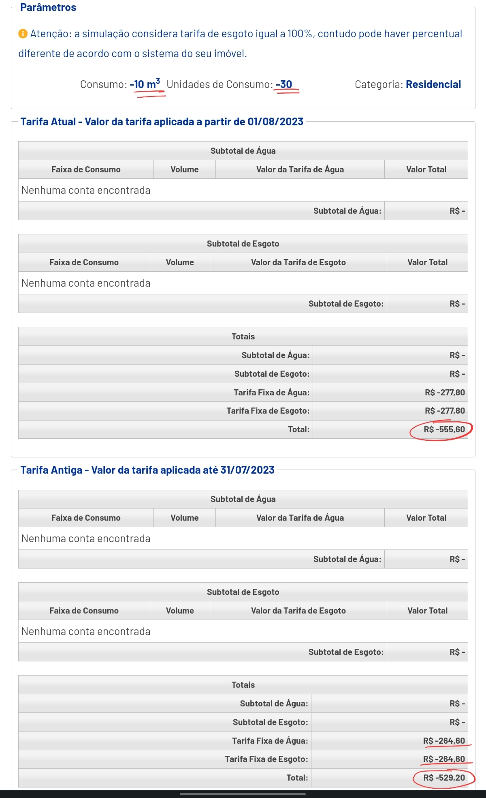

# Princípios gerais do projeto
## Introdução

&emsp;&emsp;Autores, como Norman (1988), destacam a necessidade de projetarmos o sistema utilizando um modelo conceitual que permita o usuário aprender rapidamente e sem difuculdade. Este modelo conceitual deve  auxiliar a interpretar o relacionamento entre as ações e informações apresentadas pelo sistema e o conhecimento no mundo. Norman também destava que o design deve facilitar: determinar quais ações são possíveis a cada momento, fazendo uso de restrições (constraints); tornar as coisas visíveis, incluindo o modelo conceitual do sistema,
as ações alternativas e os resultados das ações; avaliar o estado corrente do sistema e seguir mapeamentos naturais entre as intenções e as ações requeridas, entre as ações e o efeito resultante, e entre a informação que está visível e a interpretação do estado do sistema.

Para isso, os princípios e diretrizes abordam os tópicos:  

- Correspondência com as expectativas dos usuários; X 
- Simplicidade nas estruturas das tarefas;
- Equilíbrio entre controle e liberdade do usuário; X
- Consistência e padronização; X 
- Promovendo a eficiência do usuário; X 
- Antecipação;
- Visibilidade e reconhecimento; X 
- Conteúdo relevante e expressão adequada; X
- Projeto para erros; 

## Objetivo

Temos por objetivo avaliar, de acordo com os princípios de desing, se o site da  <a href="https://www.caesb.df.gov.br/" target="_blank">Caesb</a>
viola algum desses objetivos. Este artefato foi realizado por <a href="https://github.com/JeffersonSenaa" target="_blank">Jefferson Sena</a> e <a href="https://github.com/Tiago1604" target="_blank">Tiago Albuquerque</a>.

## Correspondência com as expectativas dos usuários

&emsp;&emsp; Deve existir uma
correspondência entre as variáveis do mundo real e do sistema projetado. Se
um sistema projetado é uma versão de algo que já existe no mundo real, esse
sistema deveria corresponder com as expectativas que o usuário tem sob o
mundo real. Devemos nos certificar de que o usuário consegue determinar os
relacionamentos entre: intenções e ações possíveis; entre ações e seus
efeitos no sistema; entre o estado real do sistema e o que é percebido pela
visão, audição ou tato; entre o estado percebido do sistema e as
necessidades, intenções e expectativas do usuário.

## Simplicidade nas estruturas das tarefas

&emsp;&emsp;Norman (1988) recomenda
simplificar a estrutura das tarefas, reduzindo a quantidade de planejamento e
resolução de problemas que elas requerem. Tarefas que são
desnecessariamente complexas devem ser reestruturadas, utilizando
inovações tecnológicas. 

## Equilíbrio entre controle e liberdade do usuário

&emsp;&emsp;É importante manter o
usuário no controle durante o design de IHC. O usuário deve se sentir no
comando, ter o controle sobre o computador, a interface e o ambiente de
trabalho. É necessário reduzir o número de opções ou decisões que o usuário
precisa tomar constantemente. Os usuários não devem ser presos a um único
caminho de interação. Usuário experientes devem ser possibilitados de
iniciarem ações e controlar o sistema. Oferecer a capacidade dos usuários de
desfazer ações.

<figure markdown>
<b>Figura 1</b> - Violação: Equilíbrio entre Controle e Liberdade do Usuário

{width: 500}

 Fonte: <a href="https://www.caesb.df.gov.br/" target="_blank">Caesb</a>.

</figure>

## Consistência e Padronização

&emsp;&emsp;Norman (1988) recomenda assegurar a
consistência da interface com o modelo conceitual embutido no sistema, para
facilitar o aprendizado e o uso. Isso significa que todos os aspectos do
produto, incluindo design, imagem, documentação e manuais, devem estar
alinhados com e exemplificar o funcionamento do modelo conceitual
subjacente. De acordo com Norman e Tognazzini (2014), a consistência mais
importante é com as expectativas dos usuários. A terminologia deve ser
consistente em todo o sistema. No entanto, alguns elementos de interface
exigem maior consistência do que outros. Elementos que não têm
correspondência visual ou cuja operação é internalizada pelos usuários
devem permanecer consistentes em todo o sistema. Por outro lado,
elementos que têm comportamentos diferentes devem ter aparências
distintas para evitar confusão.

<figure markdown>
<b>Figura 2</b> - Consistência e Padronização

{width: 500}

 Fonte: <a href="https://www.caesb.df.gov.br/" target="_blank">Caesb</a>.

</figure>

## Promovendo a eficiência do usuário

&emsp;&emsp;O usuário deve ser mantido ocupado,
processamento demorados não devem impedi-lo de realizar outras atividades
no sistema. O sistema deve salvar coisas já feitas pelo usuário, evitando a
perda de trabalho. O sistema deve fornecer atalhos e aceleradores, como
teclas de atalho e botões na barra de ferramenta.

## Antecipação

&emsp;&emsp;Consiste em tentar prever o que o usuário quer e precisa, tomando iniciativas e fornecendo informações adicionais que podem ser úteis antes mesmo que o usuário pergunte por elas.

<figure markdown>
<b>Figura 3</b> - Violação: Antecipação

{width: 500}

 Fonte: <a href="https://www.caesb.df.gov.br/" target="_blank">Caesb</a>.

</figure>

## Visibilidade e reconhecimento

&emsp;&emsp;Visibilidade e Reconhecimento: O estado do sistema, os objetos, as ações e
as opções devem estar atualizados e facilmente perceptíveis. O usuário deve
reconhecer as partes da aplicação. O sistema deve fornecer feedbacks a
respeito do que ocorreu ou está ocorrendo, no tempo correto. Ações
frequentes, informações de status podem ser sutis, mas par ações
infrequentes e com grandes consequências, a resposta deve ser mais
substancial. 

<figure markdown>
<b>Figura 4</b> - Violação: Visibilidade e Reconhecimento

{width: 500}

 Fonte: <a href="https://www.caesb.df.gov.br/" target="_blank">Caesb</a>.

</figure>

## Conteúdo relevante e expressão adequada
 
&emsp;&emsp;Projeto estético e minimalista.
Mensagens de instrução e ajuda devem ser concisas e informativas sobre
problemas que ocorrerem. Rótulos de menus e botões devem ser claros e
livres de ambiguidade e o texto deve ser legível. 

<figure markdown>
<b>Figura 5</b> - Violação: Conteúdo relevante e expressão adequada

{width: 500}

 Fonte: <a href="https://www.caesb.df.gov.br/" target="_blank">Caesb</a>.

</figure>

## Projeto para erros
 
&emsp;&emsp;Deve ser fácil reverter as operações e difícil realizar
ações irreversíveis. Os usuários devem ser auxiliados quanto a
reconhecerem, diagnosticarem e se recuperarem de erros. Controle de
funções utilizadas frequentemente não devem ficar ao lado de outros
controles que são considerados perigosos ou que raramente são usados. 

<figure markdown>
<b>Figura 6</b> - Violação: Projeto para Erros

{width: 500}

 Fonte: <a href="https://www.caesb.df.gov.br/" target="_blank">Caesb</a>.

</figure>

## Histórico de versão

| Versão |    Data    |      Descrição       |  Autor(es) | Revisor(es) |
| :----: | :--------: | :------------------: | :-----: | :-----: |
|  1.0   | 19/10/2023 | Adiciona Princípios Gerais do projeto | Jefferson e Tiago | Leandro e Pedro |

