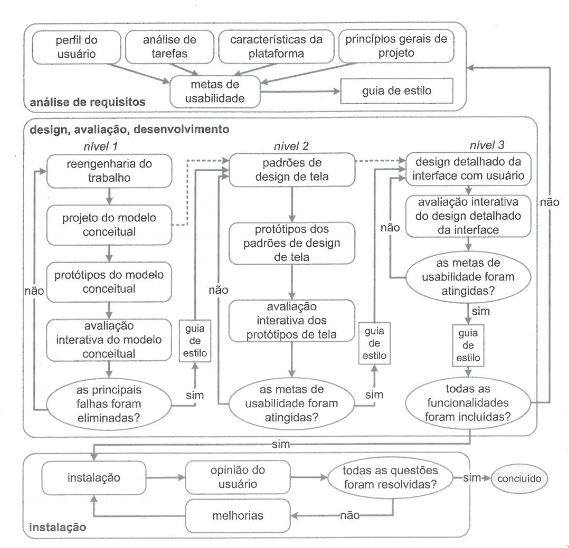

# Ciclo de Vida

## Introdução

&emsp;&emsp;A engenharia de usabilidade de Mayhew reúne e organiza diferentes atividades propostas na área de IHC para orientar o trabalho do designer em direção a uma boa solução interativa. Ela divide a análise em três fases a análise de requisitos que consiste em definir as metas de usabilidade utilizando o perfil do usuário, análise de tarefas entre outros. A segunda fase sendo a de design, avaliação e desenvolvimento da solução de IHC que atenda as metas definidas previamente, e por fim, a última fase de instalação que consiste na obtenção do feedback dos usuários para resolver questões e conseguir melhorias.

## Motivo da Escolha

&emsp;&emsp;Durante a escolha do processo de design, os membros do grupo discutiram os pontos positivos e negativos de cada modelo, concluindo que a engenharia de usabilidade de Mayhew seria a opção mais adequada. Este modelo destaca a importância de envolver os usuários desde as fases iniciais do desenvolvimento, garantindo que suas necessidades e expectativas sejam consideradas desde o início. Além disso, a engenharia de usabilidade de Mayhew incorpora heurísticas de usabilidade que facilitam a identificação de problemas comuns, podendo melhorar a experiência do usuário. Por isso o projeto foi organizado de acordo com as atividades de análise de requisitos e design, avaliação e desenvolvimento.

 <figcaption>Figura 1: Engenharia de usabilidade de Mayhew </figcaption> 

 <figcaption>Fonte: BARBOSA, Simone; DINIZ, Bruno. 2010 </figcaption> 

## Bibliografia

> 1. BARBOSA, S. D. J.; SILVA, B. S. Interação Humano-Computador. Rio de Janeiro: Elsevier, 2011.

## Histórico de versão

| Versão |    Data    |      Descrição       |  Autor(es) | Revisor(es) |
| :----: | :--------: | :------------------: | :-----: | :-----: |
|  1.0   | 05/12/2023 | Adiciona ciclo de vida| Leandro | Oscar |

