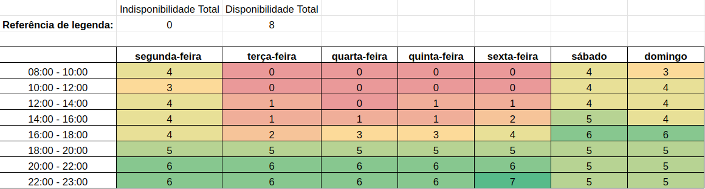

# Heatmap

## Introdução
&emsp;&emsp;Estudamos os horários dos integrantes da equipe através de um mapa de calor, para termos uma noção de como organizariamos as atividades do grupo, e qual seria os melhores horários para as reuniões.

 <figcaption>Figura 1: Heatmap</figcaption> 

 Fonte: <a href="https://github.com/leomitx10" target="_blank">Leandro de Almeida</a>, 2023

&emsp;&emsp;Logo, através do estudo deste mapa, a equipe então definiu que os melhores horários para reunião seriam entre as 19h até as 22h de segunda a sexta e durante os finais de semana 14h até as 18h, optando para sempre que possível realizá-las através do  Microsoft Teams<a href="#1">1</a>.

## Referências

> 
 1. Teams. Disponível em: <https://www.microsoft.com/pt-br/microsoft-teams/group-chat-software>. Acesso em: 5 dez. 2023.

## Histórico de versão

| Versão | Data | Descrição  | Autor        | Revisor |
| :-----: | :----: | :----------: | :------------: | :--------: |
| 1.0 | 27/09/2023 |  Colocando o heatmap| Leandro | Oscar |
| 2.0 | 06/12/2023 |  Corrigindo o heatmap| Leandro | Oscar |

