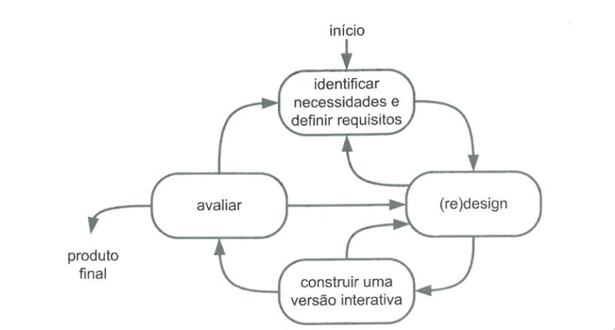
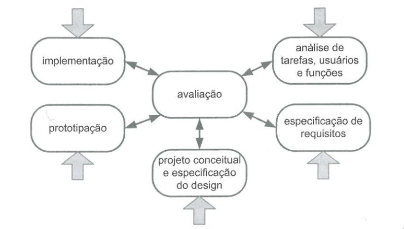

# Processo de design

## Introdução

Design é um processo que possui três atividades principais sendo elas:

* Análise da situação atual: Consiste em estudar e interpretar a situação atual;
* Síntese de uma intervenção: É planejar e realizar uma intervenção na situação atual previamente analisada;
* Avaliação da nova situação: Consiste na análise dos efeitos da intervenção feita, comparando a situação analisada no primeiro tópico com a nova situação atingida por meio da intervenção proposta.

Para a realização dessas atividades existem os processos de design, que propõem métodos iterativos e ordenados para que se atenda o objetivo final de design que seria atender às necessidades dos usuários e outros envolvidos no sistema em análise. Para esse projeto foram analisados quatro principais processos de design sendo eles o ciclo de vida simples, o ciclo de vida em estrela, a engenharia de usabilidade de Nielsen e a engenharia de usabilidade de Mayhew. Esses processos serão definidos e analisados abaixo.

## Processos

### Ciclo de vida simples

Esse processo apresenta simplicidade em seu desenvolvimento e para ele não existe muita descrição para suas etapas, por isso é recomendado para projetos pequenos.

 <figcaption>Figura 1: Ciclo de vida simples  </figcaption> 

 <figcaption>Fonte: BARBOSA, Simone; DINIZ, Bruno. 2010.</figcaption> 

 

**Pontos positivos:**

- Poucas fases sendo bom para projetos pequenos;
- Simplicidade de implementar;

**Pontos negativos:**

- Falta de descrição nas etapas;
- Muito simples para projetos maiores;

### Ciclo de vida em estrela

Esse ciclo de vida permite o início de sua execução por qualquer "ponta" da estrela e deve-se passar sempre pela avaliação após a realização das atividades. Esse ciclo de vida apresenta um pouco mais de detalhamento que o ciclo de vida simples.

 <figcaption>Figura 2: Ciclo de vida em estrela </figcaption> 

 <figcaption> Fonte: BARBOSA, Simone; DINIZ, Bruno. 2010.</figcaption> 

**Pontos positivos:**

- Maior detalhamento em relação ao ciclo de vida simples;
- Pode ser iniciado pela atividade que quiser;

**Pontos negativos:**

- Ainda é muito simples para projetos complexos;
- Recomendado para designers experientes;

### Engenharia de usabilidade de Nielsen

Propões uma série de atividades para se fazer a análise, sendo elas:

1. Conhecer o usuário;
2. Realizar uma análise competitiva;
3. Definir as metas de usabilidade;
4. Fazer designs paralelos;
5. Adotar o design participativo;
6. Fazer o design coordenado de toda a interface;
7. Aplicar diretrizes e análise heurística;
8. Fazer protótipos;
9. Realizar testes empíricos;
10. Praticar design iterativo.

**Pontos positivos:**

- Atividades bem definidas para a realização do método;
- Atividades também estão presentes nos outros ciclos de vida;

**Pontos negativos:**

- Simplicidade e falta de descrição;
- Falta de iteratividade entre as atividades propostas;

### Engenharia de usabilidade de Mayhew

Esse processo divide a análise em três fases a análise de requisitos que consiste em definir as metas de usabilidade utilizando o perfil do usuário, análise de tarefas entre outros. A segunda fase sendo a de design, avaliação e desenvolvimento da solução de IHC que atenda as metas definidas previamente, e por fim, a última fase de instalação que consiste na obtenção do feedback dos usuários para resolver questões e conseguir melhorias.

 <figcaption>Figura 3: Engenharia de usabilidade de Mayhew </figcaption> 

 <figcaption>Fonte: BARBOSA, Simone; DINIZ, Bruno. 2010 </figcaption> 

**Pontos positivos:**

- Alto detalhamento e descrição;
- Bem iterativo entre suas fases;
- Bom para designers inexperientes e projetos mais complexos;

**Pontos negativos:**

- Maior complexidade para entender o processo;

## Ciclo de vida para o projeto

Para o projeto tendo em vista os pontos negativos e positivos de todos esses processos analisados ficou definido que será utilizado a engenharia de usabilidade de Mayhew, uma vez que seus passos são bem claros e iterativos, de forma a permitir designers menos experientes aplicá-los com sucesso em projetos mais complexos. 

## Referências

> BARBOSA, S. D. J.; SILVA, B. S. Interação Humano-Computador. Rio de Janeiro: Elsevier, 2011.

## Histórico de versão

| Versão |    Data    |      Descrição       |  Autor(es) | Revisor(es) |
| :----: | :--------: | :------------------: | :-----: | :-----: |
|  1.0   | 27/09/2023 | Adicionou as definições e o ciclo de vida escolhido| Pedro e Rodrigo | Mateus |

