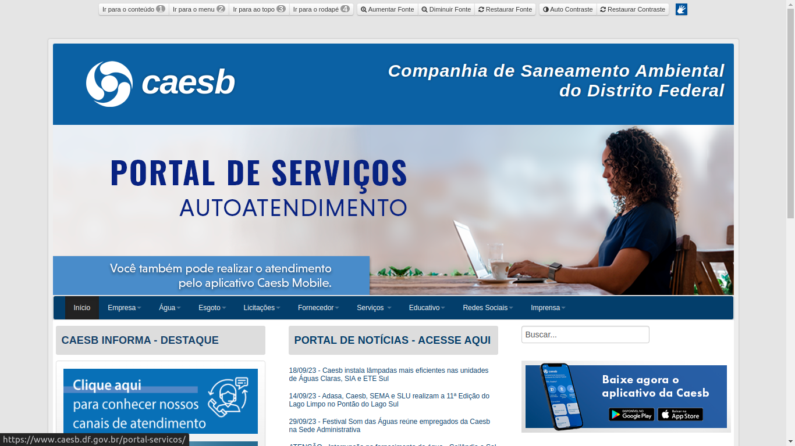

# Site escolhido

## Introdução

&emsp;&emsp; Na fase inicial do projeto de Interação Humano-Computador, os estudantes individualmente selecionaram websites governamentais ou de comunidades de software livre e realizaram avaliações de usabilidade com base no framework DECIDE. Em seguida, em grupos, discutiram e escolheram o website que apresentava os desafios mais significativos em usabilidade, trabalhando para propor melhorias práticas e aplicar seus conhecimentos teóricos em um contexto real.

## Website escolhido pela equipe

&emsp;&emsp;Após a seleção individual, o grupo discutiu as sugestões, levando em consideração os seguintes critérios:

1. O website apresenta questões relacionadas à usabilidade.
2. O website pertence ao governo ou a uma comunidade de software livre.
3. Os usuários do website podem acessá-lo de maneira livre e conveniente.

## CAESB - COMPANHIA DE SANEAMENTO AMBIENTAL DO DISTRITO FEDERAL

&emsp;&emsp; A Companhia de Saneamento Ambiental do Distrito Federal, conhecida como CAESB, é uma empresa pública responsável pelo abastecimento de água e tratamento de esgoto na região do Distrito Federal, Brasil. Com a missão de fornecer serviços essenciais para a população, a CAESB mantém um compromisso contínuo com a qualidade e eficiência de seus serviços, e isso inclui a interação com seus clientes por meio de seu site oficial.

Razões para avaliar o site da CAESB:

1. **Relevância e Importância dos Serviços**: 
&emsp;&emsp;A CAESB desempenha um papel crucial no fornecimento de água e tratamento de esgoto, serviços essenciais para a vida das pessoas. Portanto, seu site é uma ferramenta vital para fornecer informações, relatórios de serviços, e interações com os clientes.

2. **Acessibilidade**: 
&emsp;&emsp;Garantir que todos os cidadãos possam acessar informações e serviços relacionados à água e saneamento é fundamental. O site da CAESB deve ser avaliado quanto à sua acessibilidade para garantir que atenda a uma ampla variedade de necessidades dos usuários, incluindo pessoas com deficiências.

3. **Usabilidade e Navegação**: 
&emsp;&emsp;A eficácia do site em ajudar os usuários a encontrar informações rapidamente e realizar ações, como relatar problemas, pagar contas ou obter informações sobre a qualidade da água, é essencial. Uma análise de sua usabilidade pode revelar áreas de melhoria.

4. **Design e Interface**: 
&emsp;&emsp;Uma abordagem minimalista e visualmente atraente pode melhorar a experiência do usuário. O design do site deve ser estudado quanto à sua eficácia em transmitir informações de forma clara e atrativa.

5. **Suporte ao Cliente**: 
&emsp;&emsp;A presença de informações de suporte, incluindo números de contato, FAQs (Perguntas Frequentes) e formulários de contato, é crucial para atender às necessidades dos clientes.

&emsp;&emsp;  A avaliação da interação humano-computador no contexto desse site pode ajudar a identificar áreas para melhorias, garantindo que ele continue a servir efetivamente a comunidade, fornecendo informações e serviços essenciais de maneira acessível e eficaz.

Imagem da página inicial do Website da CAESB. [Fonte: https://www.caesb.df.gov.br/](https://www.caesb.df.gov.br/)

## Histórico de versão

| Versão |    Data    |      Descrição       |  Autor  | Revisor |
| :----: | :--------: | :------------------: | :-----: | :-----: |
|  1.0   | 01/10/2023 | Declaração do Site  | Oscar de Brito | Mateus, Jefferson, Leandro, Oscar, Pedro, Rodrigo e Tiago  |

---

## Referências

> BARBOSA, Simone; DINIZ, Bruno. Interação Humano-Computador. Editora Elsevier, Rio de Janeiro, 2010.

> Site da Caesb. Disponível em: <https://www.caesb.df.gov.br/>. Acesso em: 26 set. 2023.

<b>Grupo 6</b>

Interação Humano-Computador  

